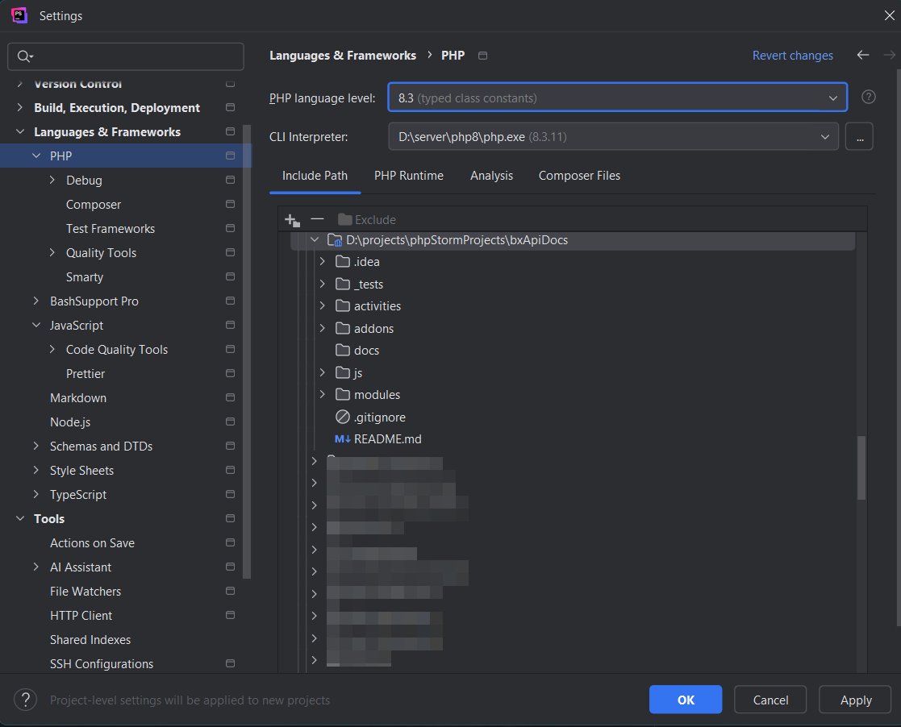
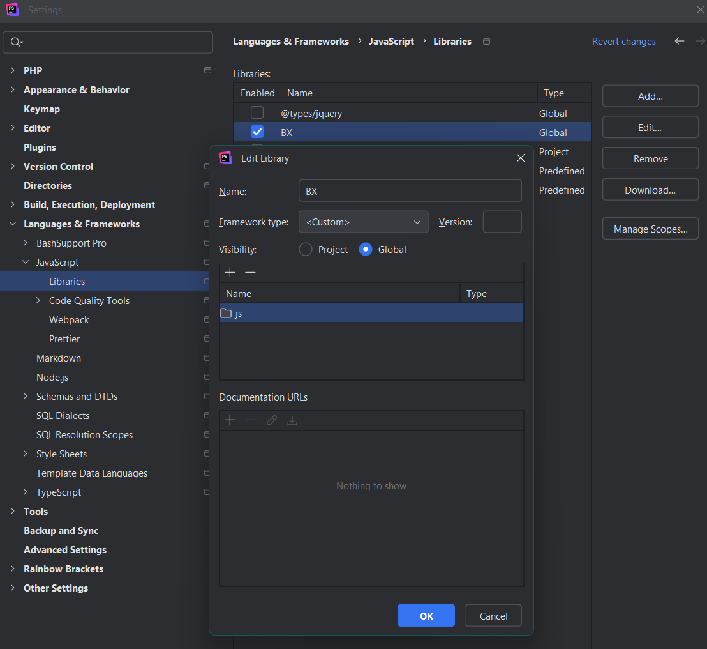
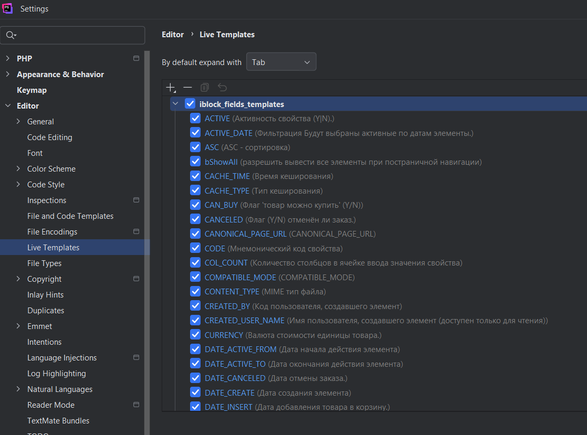
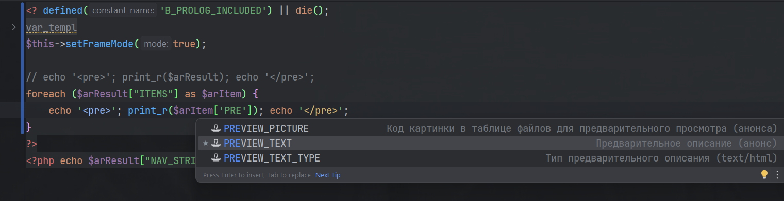

## Fork from bxApiDocs with updates

```
 ______________________________________
< When you still use bitrix its needed >
--------------------------------------
                       \                    ^    /^
                        \                  / \  // \
                         \   |\___/|      /   \//  .\
                          \  /O  O  \__  /    //  | \ \           *----*
                            /     /  \/_/    //   |  \  \          \   |
                            @___@`    \/_   //    |   \   \         \/\ \
                           0/0/|       \/_ //     |    \    \         \  \
                       0/0/0/0/|        \///      |     \     \       |  |
                    0/0/0/0/0/_|_ /   (  //       |      \     _\     |  /
                 0/0/0/0/0/0/`/,_ _ _/  ) ; -.    |    _ _\.-~       /   /
                             ,-}        _      *-.|.-~-.           .~    ~
            \     \__/        `/\      /                 ~-. _ .-~      /
             \____(oo)           *.   }            {                   /
             (    (--)          .----~-.\        \-`                 .~
             //__\\  \__ Ack!   ///.----..<        \             _ -~
            //    \\               ///-._ _ _ _ _ _ _{^ - - - - ~
```
### Using:

Repo is just IDE-helper to write bitrix-based code.

1/ Clone repo to your local folder, in my case is D:\projects\bxApiDocs

2/ Config phpStorm to view bitrix php code hints:



3/ Config phpStorm to view bitrix js code hints (add your D:\projects\bxApiDocs\js folder in my case):



More info see in [main repo](https://github.com/matiaspub/bxApiDocs).

### 4/ Addons with Live Templates

To write bitrix-based code I use some Live Templates: see all of them in forder [addons/PhpStrom-LiveTemplates](addons/PhpStrom-LiveTemplates)

You can import and [use this live templates](https://www.jetbrains.com/help/phpstorm/sharing-live-templates.html) in your PhpStorm IDE

Example:
Import iblock default fields like phpStorm Live-templates
see 'addons/iblock_fields_templates.xml' and 'addons/PHP bitrix.xml'



and see autocomplete for iblock fields in templates of component:



### Thanks and Enjoy!
